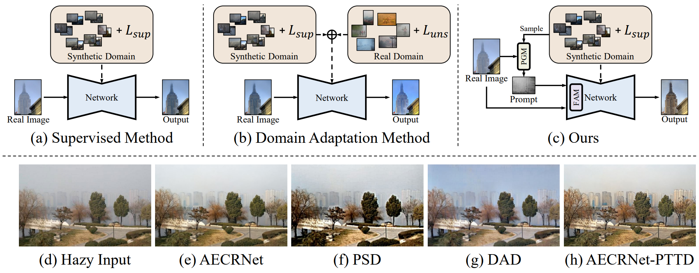

<div align="center"> 

<h2> 
Prompt-based test-time real image dehazing: a novel pipeline

(ECCV 2024)
</h2>


[Zixuan Chen](https://scholar.google.com.hk/citations?user=pwixOhcAAAAJ&hl=ja&oi=sra), [Zewei He](https://scholar.google.com.hk/citations?user=yCHs_IsAAAAJ&hl=ja&oi=sra), [Ziqian Lu](https://scholar.google.com.hk/citations?user=qx1yRVEAAAAJ&hl=zh-CN&oi=ao), [Xuecheng Sun](https://scholar.google.com.hk/citations?user=T70wj9gAAAAJ&hl=zh-CN&oi=ao), [Zheming Lu](https://person.zju.edu.cn/lzmhome/)

Zhejiang University

[](https://www.ecva.net/papers/eccv_2024/papers_ECCV/papers/09815.pdf)

</div>


## :mega: News
- **2024.10.27**: :fire::fire::fire: Implementations of AECRNet-PTTD is available now.
- **2024.7.2**: :tada::tada::tada: Accepeted by ***ECCV 2024***
- **2023.09.29**: Arxiv version of the paper are available now.

## Getting Started

### Environment

1. Clone this repo:

```
git clone https://github.com/cecret3350/PTTD-Dehazing.git
cd PTTD-Dehazing/
```

2. Create a new conda environment and install dependencies:

```
conda create -n pytorch_2_1_1 python=3.8
conda activate pytorch_2_1_1
conda install pytorch==2.1.1 torchvision==0.16.1 torchaudio==2.1.1 pytorch-cuda=12.1 -c pytorch -c nvidia
```

3. Build DCNv2 for AECRNet

```
cd model/DCNv2
rm -rf build
python setup.py build develop
```

### Inference
Since our proposed PTTD is a test-time dehazing method, we do not need any additional training procedures. Your can run the following command to perform PTTD based on pre-trained AECRNet.

```
python pttd.py --source RIDCP --model AECRNet --pretrained_path ./pretrained_checkpoints --ys ./ys/0543.jpg --input input_samples/ --output results
```
You can use ```--save_all``` to save the dehazed results generated by the original pre-trained model and other intermediate results generated during PTTD-Dehazing.

You can also try other $y_s$ from the GTs of the [source dataset](https://github.com/RQ-Wu/RIDCP_dehazing?tab=readme-ov-file).

### Evaluation
We also provide scripts for performance evaluation on NTIRE datasets (resized O-HAZE dataset and I-HAZE dataset can be downloaded from [Zero-Restore](https://github.com/aupendu/zero-restore)).
```
python pttd.py --source RIDCP --model AECRNet --pretrained_path ./pretrained_checkpoints --ys ./ys/0543.jpg --input <PATH_TO_OHAZE_DATASET_INPUT> --output results_OHAZE
python val.py --result_dir results_OHAZE --gt_dir <PATH_TO_OHAZE_DATASET_GT>
```

## :love_you_gesture: Citation
If you find our paper and repo are helpful for your research, please consider citing:
```
@article{chen2023promptbased,
      title={Prompt-based test-time real image dehazing: a novel pipeline}, 
      author={Zixuan Chen and Zewei He and Ziqian Lu and Zhe-Ming Lu},
      booktitle = {European Conference on Computer Vision (ECCV)},
      year = {2024}
}
```

### Contact
If you have any questions or suggestions about our paper and repo, please feel free to contact us via <zxchen@zju.edu.cn> or <zeweihe@zju.edu.cn>.
