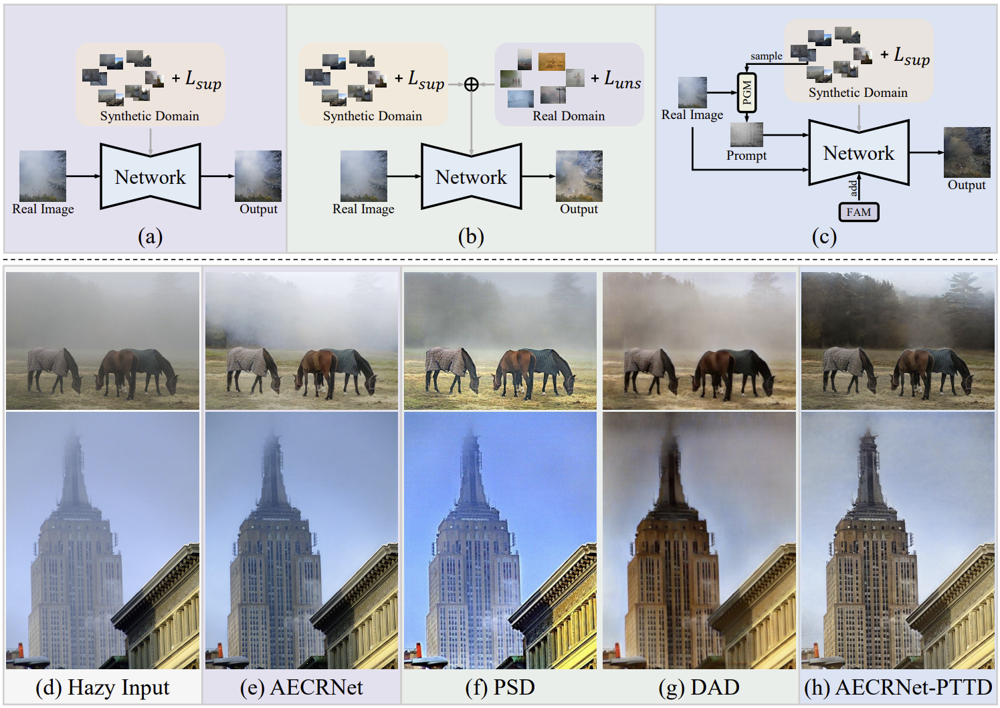
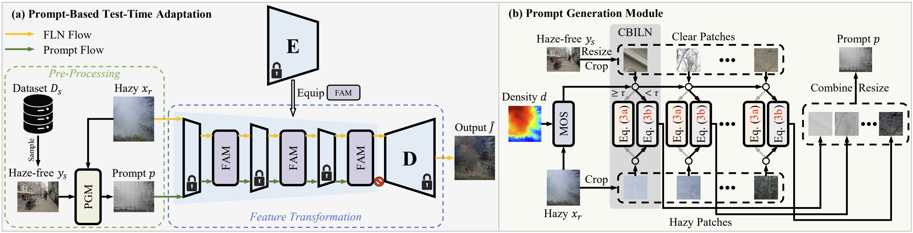

<div align="center">
<h1> Prompt-based test-time real image dehazing: a novel pipeline </h1>
</div>
<div>
    <h4 align="center">
        <a href="https://github.com/cecret3350/PTTD-Dehazing" target='_blank'>[Project Page]</a>
        <a href="https://arxiv.org/abs/2309.17389" target='_blank'>[arXiv]</a> 
	</h4>
</div>




## :mega: News
- **2023.09.29**: Arxiv version of the paper are available now.

## :love_you_gesture: Citation
If you find our paper and repo are helpful for your research, please consider citing:
```
@article{chen2023promptbased,
      title={Prompt-based test-time real image dehazing: a novel pipeline}, 
      author={Zixuan Chen and Zewei He and Ziqian Lu and Zhe-Ming Lu},
      journal={arXiv preprint arXiv:2309.17389},
      year={2023}
}
```

### Contact
If you have any questions or suggestions about our paper and repo, please feel free to contact us via <22224039@zju.edu.cn> or <zeweihe@zju.edu.cn>.
